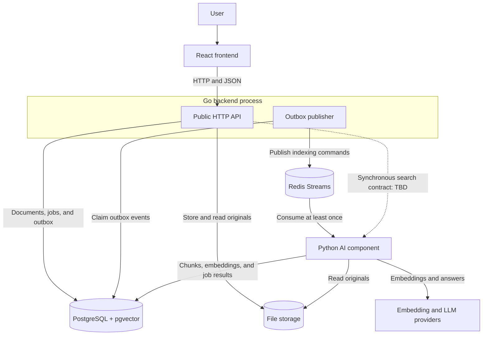

# DocMind component diagram

## Purpose

This document presents the runtime components and primary data flows planned for the DocMind MVP.

It complements [ADR-001](../adr/0001-use-monorepository.md) and [ADR-002](../adr/0002-use-modular-go-monolith-and-separate-python-ai-component.md). It does not define the internal Go package structure, database schema, or exact cross-component message and API contracts.

## Diagram

## Components

| Component | Responsibility |
| --- | --- |
| React frontend | Provides the browser user interface for document operations, indexing status, and search. |
| Go backend | Exposes the public HTTP API and owns transactional application workflows, document metadata, indexing job creation, and public response contracts. |
| Outbox publisher | Runs inside the Go API process for the MVP, claims unpublished outbox events, and publishes indexing commands to Redis Streams. |
| Python AI component | Consumes indexing commands and performs parsing, normalization, chunking, token counting, embeddings, retrieval, context construction, and language-model interaction. |
| PostgreSQL with pgvector | Stores authoritative application state, indexing results, and vectors used for retrieval. |
| Redis Streams | Delivers asynchronous indexing commands with at-least-once semantics. |
| File storage | Stores original document files behind a storage abstraction. The initial implementation uses a shared local volume. |
| Embedding and LLM providers | Supply model capabilities behind Python interfaces. Automated tests use fakes; real providers are reserved for explicit integration and evaluation runs. |

## Primary flows

### Upload and indexing

1. The user selects a document in the React frontend.
2. The frontend uploads the document through the public Go API.
3. The Go backend stores the original file and creates the document, indexing job, and outbox event in one PostgreSQL transaction.
4. The outbox publisher claims the event and publishes an indexing command to Redis Streams.
5. The Python component consumes the command idempotently, reads the original file, and performs the indexing pipeline.
6. The Python component stores chunks, embeddings, warnings, counts, and the final job outcome in PostgreSQL.
7. The frontend periodically requests the current indexing status from the Go API until the job reaches a terminal state.

### Search

1. The frontend sends a question to the public Go API.
2. The Go backend delegates AI-specific search processing through a synchronous cross-component contract.
3. The Python component creates the query embedding, retrieves relevant chunks from PostgreSQL, constructs context, and invokes the configured language model.
4. The Go backend returns the answer and structured citations through the public API.

The exact synchronous protocol between Go and Python remains intentionally undecided until semantic search implementation begins.

## Architectural rules

- The React frontend communicates with the Go backend, not directly with the Python component, PostgreSQL, Redis, file storage, or model providers.
- The Go backend is the only public backend entry point.
- PostgreSQL is the source of truth for indexing state. Redis Streams only delivers commands.
- Redis delivery may be repeated, so the Python consumer must be idempotent.
- Original files are referenced by storage keys rather than container-specific absolute paths.
- In the initial Docker Compose deployment, Go and Python share one named volume, while the Python worker receives read-only access to original files.
- Automated tests use fake embedding and language-model providers. Real external model calls are not part of ordinary CI.
- Sharing one Git repository does not remove runtime, dependency, or contract boundaries between Go and Python.

## Deferred decisions

The following details will be documented immediately before their implementation:

- the internal Go module diagram;
- database tables and ownership rules;
- Redis Stream names and message schemas;
- the synchronous search protocol between Go and Python;
- production file storage and deployment topology;
- model selection and provider-specific configuration.
